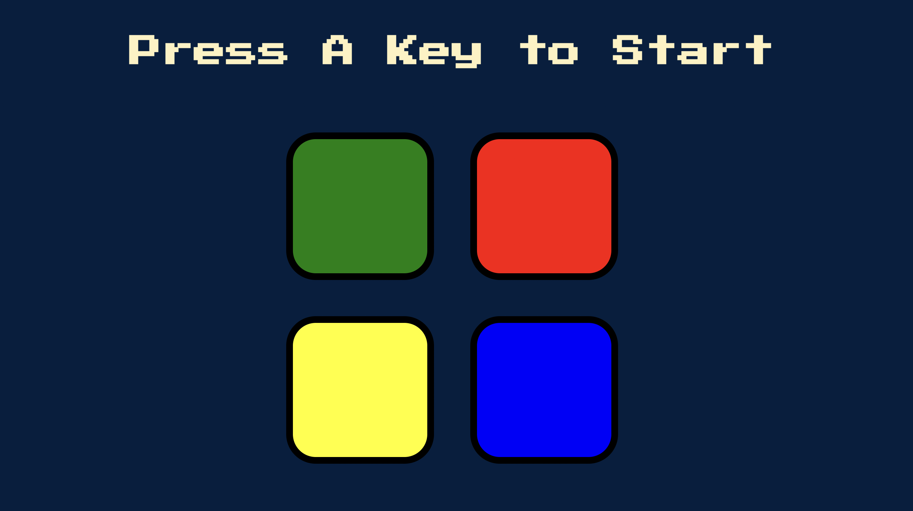

# Simon Game

This is a solution to Simon Game challenge in [The Complete 2022 Web Development Bootcamp](https://www.udemy.com/course/the-complete-web-development-bootcamp/) taught by Angelu Yu of [The App Brewery](https://appbrewery.com/).

## Table of contents

- [Overview](#overview)
  - [The challenge](#the-challenge)
  - [Screenshot](#screenshot)
  - [Links](#links)
- [My process](#my-process)
  - [Built with](#built-with)
  - [What I learned](#what-i-learned)
  - [Continued development](#continued-development)
- [Author](#author)

## Overview

### The challenge

Users should be able to play the Simon Game:

- The user presses any key to start the game which triggers the first color to flash accompanied by an unique sound
- The user clicks on the correct color to move to the next level
- A correct answer will trigger the next color in the sequence
- The user will respond by clicking both the first color and second color in the sequence in the correct order to submit the correct answer
- The sequence continues until the user clicks on an incorrect color, at which point they can start the game over and try again

### Screenshot

### Links

- Solution URL: [Simon Game](https://mollibeth.dev/simon-game)

## My process

### Built with

- Javascript

### What I learned

This project requires Javascript that responds to key strokes, plays audio, shows animations, triggers events, tracks the state and level at any given point, and compares two arrays (the game sequence and the sequence that the user input) in order to function as desired. This was a lot of fun to build and also fun to play!

### Continued development

To improve the game, I would add keystroke events that allow the user to respond without using a mouse. Additionally, I would update the CSS to allow for better usability in mobile view.

## Author

- Website - [Mollibeth Cardwell](https://www.mollibeth.dev)
